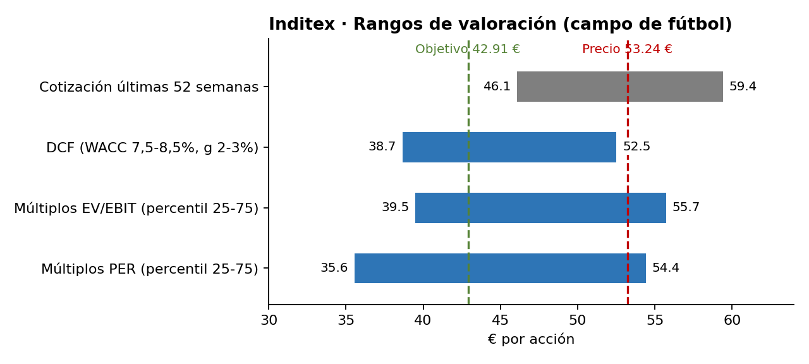
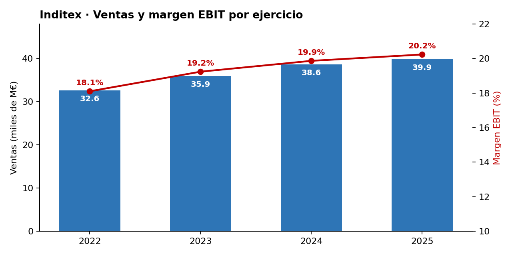
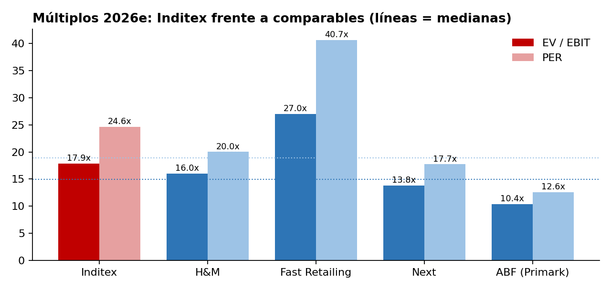

# Análisis y valoración de Inditex (ITX.MC)

> ⚠️ Ejercicio académico con fines formativos. **No es una recomendación de inversión.**

**Autor:** Manuel Pimentel · CUNEF Universidad
**Fecha del análisis:** 03/10/2026

| Precio de referencia | Precio objetivo | Potencial | Recomendación |
|:---:|:---:|:---:|:---:|
| 53,24 € | **42,91 €** | **−19%** | **VENDER** |

📄 Informe completo: [`informe/Informe_Inditex.pdf`](informe/Informe_Inditex.pdf) · 📊 Modelo: [`modelo/DCF_Inditex.xlsx`](modelo/DCF_Inditex.xlsx)

---

## 1. Resumen ejecutivo

Inditex es probablemente la mejor empresa de moda del mundo: margen EBIT del 20%, ROE del 30%, 11.000 M€ de caja neta y un flujo de caja que cubre de sobra un dividendo creciente. **El problema no es la empresa, es el precio.** A 53 € la acción cotiza a 18x EV/EBIT y 25x PER, con una prima del 20-30% sobre sus comparables, y el mercado ya descuenta muchos años de crecimiento y márgenes al alza.

Con hipótesis razonables (ventas +7% → +5%, margen EBIT hasta el 20,8%, WACC 8,2%, g 2,5%), el **DCF da 42,93 €** por acción y los **múltiplos de comparables, 42,89 €**. Los dos métodos llegan de forma independiente a la misma cifra. El **precio objetivo es de 42,91 €**, un 19% por debajo de la cotización: **recomendación VENDER**. Es una gran empresa a un precio que deja poco margen de seguridad.



## 2. La empresa en 1 minuto

- **Qué hace:** diseña, produce, distribuye y vende moda a través de tiendas físicas y canal online.
- **Marcas:** Zara, Pull&Bear, Massimo Dutti, Bershka, Stradivarius, Oysho, Zara Home y Lefties.
- **Plantilla:** más de 163.000 personas, unas 50.000 en España.
- **Cómo gana dinero:** vendiendo moda que sigue las tendencias de forma muy rápida, apoyándose en una fuerte y continuada inversión en tecnología y logística.

**Ventajas competitivas**

1. **Producción de proximidad:** fabrica buena parte cerca de España, lo que le permite reaccionar rápido a la demanda.
2. **Gestión del inventario en pequeñas tandas:** menos rebajas forzadas y un margen bruto muy alto (58,3%).
3. **Balance sólido:** más caja que deuda financiera y elevada generación de caja.

**Principales riesgos**

1. **Geopolítica y logística:** como depende tanto del transporte global, tensiones como las del estrecho de Ormuz pueden encarecer el petróleo y los fletes.
2. **Divisas:** vende en muchas monedas; en 2025 el tipo de cambio restó unos 4 puntos al crecimiento (+7% constante vs. +3% en euros).
3. **Competencia y tecnología:** su ventaja es la rapidez. Competidores digitales como Shein o Temu presionan en precio y velocidad, lo que obliga a seguir invirtiendo fuerte en tecnología.

*Otros a vigilar: costes laborales y reputación en la cadena de suministro, ciberseguridad.*

**Cifras clave del ejercicio 2025 (feb. 2025 – ene. 2026)**

| Métrica | Valor | Variación |
|---|---|---|
| Ventas | 39.864 M€ | +3% (+7% a tipo de cambio constante) |
| Margen bruto | 58,3% s/ ventas | |
| EBITDA | 11.267 M€ | +5% |
| EBIT | 7.997 M€ | +6% |
| Beneficio neto (consolidado) | 6.220 M€ | +6% |
| Dividendo por acción | 1,75 € (1,20 ordinario + 0,55 extraordinario) | |
| Dividendo total | 5.454 M€ | |
| Pay-out (dividendo / beneficio consolidado) | ≈ 88% | |

**Lectura:** los costes operativos crecen menos que las ventas (apalancamiento operativo), así que los beneficios crecen el doble que las ventas. El alto pay-out muestra que la empresa genera más caja de la que necesita para invertir.

**Nota:** la propuesta de reparto parte del beneficio de la sociedad matriz (6.360 M€: 906 M€ a reservas y 5.454 M€ a dividendos), no del consolidado del grupo (6.220 M€).

**Primer semestre 2026 (feb.–jul.):** ventas de 19.755 M€ (+7,6%; +9,2% a tipo constante), EBIT de 3.843 M€ (+7,6%) y beneficio de 2.980 M€ (+6,8%). El crecimiento se acelera respecto a 2025.

## 3. Análisis financiero

Datos: Yahoo Finance vía yfinance (notebook `02_ratios_financieros`). Ejercicio fiscal de febrero a enero. Ratios completos en [`data/processed/ratios.csv`](data/processed/ratios.csv).

| Métrica | 2022 | 2023 | 2024 | 2025 |
|---|---:|---:|---:|---:|
| Ventas (M€) | 32.569 | 35.947 | 38.632 | 39.864 |
| Crecimiento ventas | – | +10,4% | +7,5% | +3,2% |
| Margen bruto | 57,0% | 57,8% | 57,8% | 58,3% |
| Margen EBITDA | 25,4% | 27,9% | 28,3% | 29,0% |
| Margen EBIT | 18,1% | 19,2% | 19,9% | 20,2% |
| Margen neto | 12,7% | 15,0% | 15,2% | 15,6% |
| ROE | 24,3% | 28,9% | 29,8% | 30,5% |
| ROA | 13,8% | 16,4% | 16,9% | 17,5% |
| FCF (M€)\* | 5.259 | 6.795 | 6.616 | 6.520 |

\* FCF = flujo de caja operativo − capex. No descuenta los pagos por arrendamientos (NIIF 16), por lo que sobrestima la caja disponible.



**Conclusiones**

1. **El crecimiento se frena** (+10% → +3%), en parte por el efecto divisa (+7% a tipo constante en 2025).
2. **Los márgenes mejoran año tras año**: el margen EBIT sube del 18% al 20% gracias al apalancamiento operativo.
3. **Rentabilidad excelente**: ROE del 30% con muy poca deuda financiera.
4. **Generación de caja estable** en torno a 6.500 M€, suficiente para cubrir un dividendo de ~5.450 M€.

**Posición financiera neta** (caja − deuda financiera, sin arrendamientos): **10.958 M€** a 31/01/2026 (11.495 M€ un año antes). Inditex no tiene deuda neta: la "deuda total" de Yahoo (~6.000 M€) son casi todo arrendamientos de tiendas (NIIF 16). La ligera bajada se explica por el elevado dividendo (~5.450 M€).

**Pregunta clave para la valoración:** ¿puede Inditex seguir ampliando márgenes con un crecimiento de ventas cada vez menor?

## 4. Valoración

### 4.1 Descuento de flujos de caja (DCF)

Modelo completo en [`modelo/DCF_Inditex.xlsx`](modelo/DCF_Inditex.xlsx). Fecha de valoración: 03/10/2026.

**Hipótesis principales (caso base)**

| Hipótesis | Valor | Justificación |
|---|---|---|
| Crecimiento de ventas | +7% (2026e) → +5% (2030e) | 1S 2026: +7,6% (+9,2% a tipo constante) |
| Margen EBIT | 20,3% → 20,8% | FY2025: 20,1%; mejora lenta por apalancamiento operativo |
| Capex | 5,4-5,5% de ventas | Guía 2026: capex ordinario ≈ 2.300 M€ |
| Pagos por arrendamientos | 4,6% de ventas | FY2025: 1.834 M€ |
| Tipo impositivo | 22,5% | FY2025: ≈ 22,4% |
| WACC | 8,2% | Rf 4,15% (bono España 10a) + β 0,90 × ERP 4,5%; sin deuda financiera |
| Crecimiento a perpetuidad (g) | 2,5% | Inflación a largo plazo + algo de crecimiento real |

**Resultado**

| | M€ |
|---|---:|
| Valor actual de los FCF 2026e-2030e | 27.500 |
| Valor actual del valor terminal | 95.328 |
| **Valor de empresa (EV)** | **122.828** |
| (+) Caja neta | 10.958 |
| **Valor de los fondos propios** | **133.786** |
| **Valor por acción** | **42,93 €** |
| Precio a 02/10/2026 | 53,24 € |
| Potencial | **−19%** |

**Comprobación:** mi EBIT estimado para 2026e (8.659 M€) es casi idéntico al del consenso de analistas (8.667 M€). La diferencia con el mercado no está en las previsiones de beneficio, sino en **cuánto se paga por ellas**.

**Tratamiento de los arrendamientos:** los pagos por alquileres de tiendas se restan del FCF como un coste de caja más. Por eso no se resta la deuda por arrendamientos (NIIF 16) del valor de empresa. Solo se suma la caja neta financiera.

### 4.2 Sensibilidad

Valor por acción (€) según WACC y g:

| WACC \ g | 1,5% | 2,0% | 2,5% | 3,0% | 3,5% |
|---|---:|---:|---:|---:|---:|
| 7,0% | 45,5 | 49,0 | **53,2** | 58,5 | 65,4 |
| 7,5% | 42,1 | 44,9 | 48,3 | 52,5 | 57,7 |
| 8,0% | 39,2 | 41,5 | 44,3 | 47,7 | 51,8 |
| 8,5% | 36,7 | 38,7 | 41,0 | 43,8 | 47,1 |
| 9,0% | 34,5 | 36,2 | 38,2 | 40,5 | 43,2 |
| 9,5% | 32,6 | 34,1 | 35,8 | 37,7 | 40,0 |

**Lectura:** para justificar el precio actual (53 €) hace falta un WACC del 7% con g del 2,5%, o un crecimiento y unos márgenes más altos que los del caso base. El valor terminal supone el 78% del EV, así que el resultado depende mucho de las hipótesis de largo plazo.

### 4.3 Múltiplos comparables

Estimaciones de consenso del ejercicio en curso (MarketScreener, 02/10/2026):

| Empresa | EV / EBIT | PER | Comentario |
|---|---:|---:|---|
| **Inditex** | **17,9x** | **24,6x** | |
| H&M | 16,0x | 20,0x | Competidor directo, margen EBIT ≈ 9% |
| Fast Retailing (Uniqlo) | 27,0x | 40,7x | El otro "ganador" global; cotiza con prima |
| Next plc | 13,8x | 17,7x | Moda británica, fuerte en online |
| ABF (Primark) | 10,4x | 12,6x | Incluye alimentación: cotiza con descuento |
| **Mediana comparables** | **14,9x** | **18,9x** | |



Aplicando las medianas al EBIT (8.667 M€) y al beneficio (6.735 M€) estimados de Inditex para 2026e:

- **Por EV/EBIT:** 44,98 € por acción.
- **Por PER:** 40,80 € por acción.
- **Media:** 42,89 €.

Uso EV/EBIT y PER, y no EV/EBITDA, porque cada empresa trata los alquileres de forma distinta (NIIF 16) y eso distorsiona el EBITDA.

**¿Merece Inditex una prima?** Sí. Tiene mejores márgenes que H&M, Next o ABF y caja neta en lugar de deuda. Pero el mercado ya se la está dando: cotiza un 20% por encima de la mediana en EV/EBIT y un 30% en PER. Solo Fast Retailing, que crece más deprisa, cotiza más caro.

### 4.4 Rangos de valoración

| Método | Rango (€/acción) |
|---|---|
| Cotización últimas 52 semanas | 46,1 – 59,4 |
| DCF (WACC 7,5-8,5%, g 2-3%) | 38,7 – 52,5 |
| Múltiplos EV/EBIT (percentil 25-75) | 39,5 – 55,7 |
| Múltiplos PER (percentil 25-75) | 35,6 – 54,4 |

El precio actual (53,24 €) está en la **parte alta de todos los rangos**: solo se justifica con las hipótesis más optimistas.

## 5. Conclusión

**Recomendación: VENDER · Precio objetivo: 42,91 € (−19%)**

El precio objetivo es la media del DCF (42,93 €) y de los múltiplos (42,89 €), ponderados al 50%. La regla aplicada es: Comprar si el potencial supera el +15%, Vender si cae por debajo del −15% y Mantener entre ambos.

**La tesis en tres puntos:**

1. **Negocio excepcional:** márgenes en máximos (EBIT 20%), ROE del 30%, caja neta de 11.000 M€ y un crecimiento que vuelve a acelerarse en 2026 (+7,6% en el primer semestre).
2. **Pero el precio ya lo descuenta todo:** a 53 € el mercado paga 18x EV/EBIT, frente a las 14x que justifica el DCF, y exige un WACC del 7% o márgenes muy superiores a los actuales.
3. **Poco margen de seguridad:** el 78% del valor depende del largo plazo. Cualquier tropiezo (divisas, fletes, Shein/Temu, techo de márgenes) tendría mucho impacto en el precio.

**Qué me haría cambiar de opinión (riesgos al alza para la tesis):**

- Que el margen EBIT siga subiendo hacia el 22-23%. Con un margen del 22% en 2030, el DCF sube a unos 45 €; para llegar al precio actual haría falta, además, más crecimiento.
- Que el crecimiento se mantenga por encima del 8% varios años gracias al online y a la nueva superficie de tiendas (+5% bruto en 2026).
- Que bajen los tipos de interés: con un WACC del 7%, el valor se acerca a 53 €.
- Una caída de la cotización hacia los 40-43 €, que convertiría la recomendación en Mantener o Comprar.

---

## Estructura del repositorio

```
analisis-inditex/
├── README.md              ← este resumen
├── requirements.txt       ← librerías de Python necesarias
├── data/
│   ├── raw/               ← datos descargados sin tocar
│   └── processed/         ← ratios calculados (ratios.csv)
├── notebooks/
│   ├── 01_descarga_datos.ipynb
│   └── 02_ratios_financieros.ipynb
├── src/                   ← funciones reutilizables
│   ├── datos.py
│   └── ratios.py
├── modelo/                ← DCF_Inditex.xlsx: hipótesis, DCF, sensibilidad y múltiplos
├── informe/               ← Informe_Inditex.pdf (informe final)
├── img/                   ← gráficos del análisis
└── docs/                  ← guías y notas de trabajo
```

## Cómo reproducir el análisis

**En Google Colab (sin instalar nada):** abre cualquier notebook desde GitHub con `https://colab.research.google.com/github/Manuu6/analisis-inditex/blob/main/notebooks/01_descarga_datos.ipynb` y pulsa Ctrl + F9. La primera celda prepara el entorno sola.

**En tu ordenador:**

```bash
pip install -r requirements.txt
jupyter notebook
```

Ejecuta los notebooks en orden (01 → 02). El modelo de valoración está en Excel: cambia las celdas amarillas de la pestaña *Hipótesis* y todo se recalcula.

## Fuentes

- Inditex, informes anuales y presentaciones de resultados (FY2025 y 1S 2026): <https://www.inditex.com/itxcomweb/es/es/accionistas-e-inversores>
- CNMV: <https://www.cnmv.es>
- Yahoo Finance (vía yfinance): estados financieros 2022-2025 y beta
- MarketScreener: cotizaciones y estimaciones de consenso de Inditex y comparables (02/10/2026)
- Damodaran Online (prima de riesgo de mercado): <https://pages.stern.nyu.edu/~adamodar/>
- Rentabilidad del bono español a 10 años: prensa económica (elEconomista, euribor.com.es), 03/10/2026
